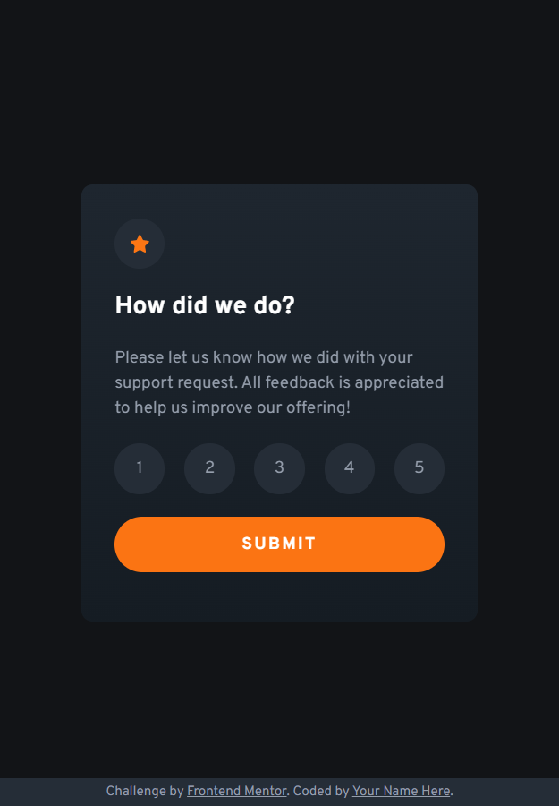
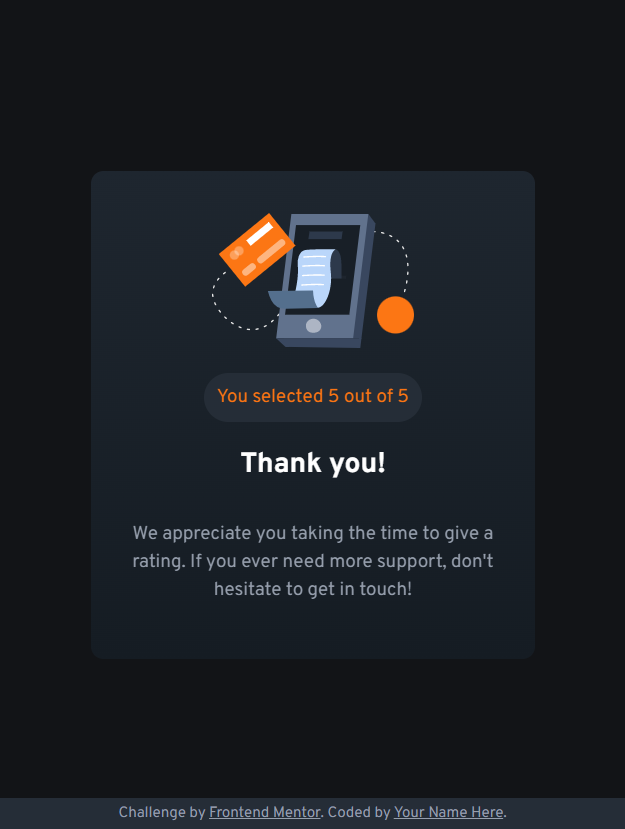

# Frontend Mentor - Interactive rating component solution

This is a solution to the [Interactive rating component challenge on Frontend Mentor](https://www.frontendmentor.io/challenges/interactive-rating-component-koxpeBUmI). Frontend Mentor challenges help you improve your coding skills by building realistic projects. 

## Table of contents

- [Overview](#overview)
  - [The challenge](#the-challenge)
  - [Screenshot](#screenshot)
  - [Links](#links)
- [My process](#my-process)
  - [Built with](#built-with)
  - [What I learned](#what-i-learned)
  - [Continued development](#continued-development)
  - [Useful resources](#useful-resources)
- [Author](#author)

## Overview

### The challenge

Users should be able to:

- View the optimal layout for the app depending on their device's screen size
- See hover states for all interactive elements on the page
- Select and submit a number rating
- See the "Thank you" card state after submitting a rating

### Screenshot

### Links

- Solution URL: [GitHub repository](https://github.com/MatheusHG94/rating-component)
- Live Site URL: [GitHub Pages](https://matheushg94.github.io/rating-component/)

## My process

### Built with

- Semantic HTML5 markup
- CSS custom properties
- Flexbox and Grid layout
- Mobile-first workflow
- JavaScript

### What I learned

This is the first challenge in which I use JavaScript code for interactions. I also tried a simple flip animation for transitioning between card sides.

### Continued development

Since I'm just starting my learning of HTML, CSS, JavaScript and web development in general, I'm still focusing on learning every aspect of these technologies, mainly the fundamentals.

### Useful resources

- [Getting value of radio button](https://blog.devgenius.io/how-to-get-the-value-of-a-selected-radio-button-with-javascript-e5ac43a6f41a) - This helped me getting the value of the selected radio button with JS.
- [Getting value of radio button](https://www.youtube.com/watch?v=J254pngGt6E) - This also helped with the issue described above.
- [Flip animation](https://www.w3schools.com/howto/howto_css_flip_card.asp) - This helped me creating the flip animation when pushing the submit button.
- [Style for label of radio input](https://developer.mozilla.org/en-US/docs/Web/CSS/:checked) - This helped me changing the style for the label associated with the checked radio input.

## Author

Matheus Henrique Grande

- GitHub - [@MatheusHG94](https://github.com/MatheusHG94)
- Frontend Mentor - [@MatheusHG94](https://www.frontendmentor.io/profile/MatheusHG94)
- LinkedIn - [@matheushg-7654](https://www.linkedin.com/in/matheushg-7654/)